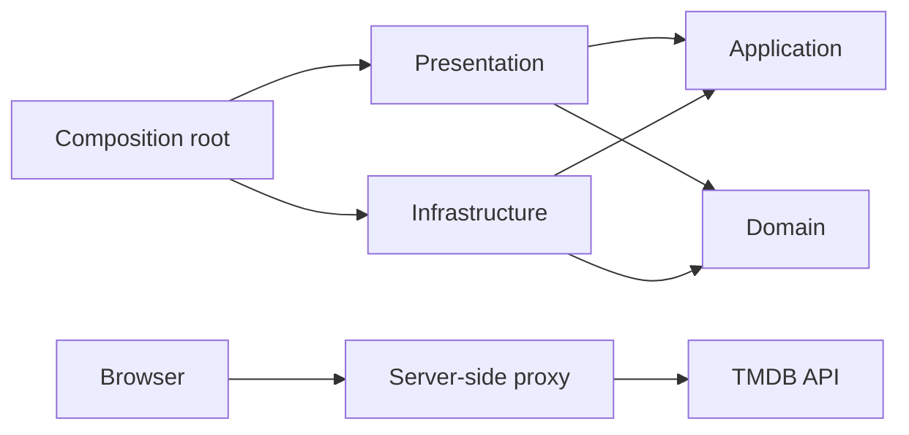
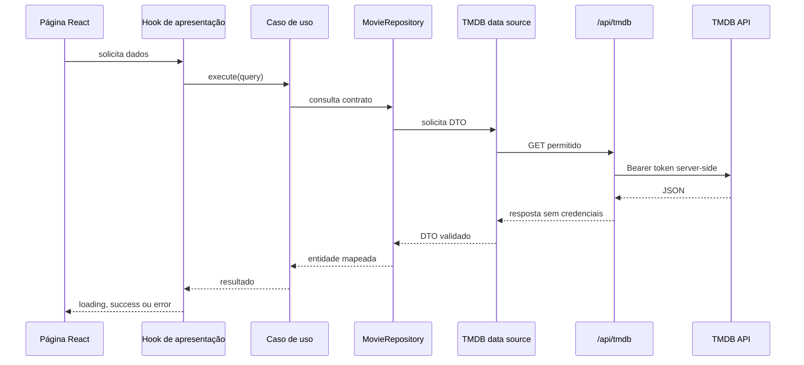

# Arquitetura

## Visão geral

O projeto aplica Clean Architecture para separar regras, interface e detalhes externos. A direção das
dependências aponta para dentro: React, armazenamento e HTTP dependem de contratos internos, enquanto
o domínio não conhece frameworks.



## Estrutura

```text
src/
|-- app/              # Roteamento e composição das dependências
|-- domain/           # Entidades e contratos de repositório
|-- application/      # Casos de uso independentes da interface
|-- infrastructure/   # Adapters de HTTP, TMDB e localStorage
|-- presentation/     # Páginas, componentes, contexts e hooks React
`-- test/             # Fixtures, mocks e suporte de integração

server/               # Backend-for-frontend local e regras do proxy
api/                  # Entrada serverless usada pela Vercel
```

## Regra de dependência

- `domain` não importa nenhuma camada externa.
- `application` depende apenas do domínio.
- `infrastructure` implementa contratos internos e não importa a interface.
- `presentation` acessa integrações por casos de uso e contexts.
- `app` é o composition root que conecta implementações concretas.

Imports entre diretórios usam o alias `@/`. O ESLint impede dependências que violem essas fronteiras.

## Fluxo de leitura



## Estado global

Dois contexts têm responsabilidades distintas:

- `MovieCatalogContext` disponibiliza casos de uso estáveis para leitura do catálogo.
- `FavoritesContext` mantém a coleção de favoritos e expõe operações de consulta e alteração.

Favoritos são persistidos no `localStorage` com uma chave versionada. O adapter valida todo o conteúdo
antes de restaurá-lo, ignora registros incompatíveis e mantém a aplicação utilizável quando o storage
não está disponível.

## Segurança e fronteira server-side

Credenciais não fazem parte do frontend. `TMDB_READ_ACCESS_TOKEN` e `TMDB_API_KEY` são carregados por
`server/config/serverEnvironment.ts`, fora de `src/`, e não usam o prefixo público `VITE_`.

O proxy segue uma política de menor privilégio:

- somente `GET` é permitido;
- existe uma allowlist de rotas e parâmetros;
- páginas são limitadas ao intervalo aceito pelo TMDB;
- busca e descoberta possuem validação específica;
- requisições externas têm timeout;
- erros retornam códigos controlados sem detalhes sensíveis;
- respostas recebem `X-Content-Type-Options` e políticas de cache adequadas.

No desenvolvimento, Vite encaminha `/api/tmdb` ao servidor Node local. Na Vercel, a mesma URL é
reescrita para `api/tmdb.ts`, mantendo o frontend independente do ambiente de hospedagem.

## Princípios aplicados

- **Responsabilidade única:** componentes, casos de uso, mappers e adapters possuem motivos de mudança
  separados.
- **Inversão de dependência:** serviços dependem de `MovieRepository` e `FavoriteMovieRepository`, não
  de Fetch, TMDB ou localStorage.
- **Aberto/fechado:** novos adapters podem implementar os contratos sem alterar regras existentes.
- **Segregação de interfaces:** contratos expõem apenas operações necessárias ao catálogo ou aos
  favoritos.
- **Imutabilidade:** entidades e coleções mapeadas são congeladas nas fronteiras relevantes.

## Decisões e trade-offs

### Favoritos locais

O teste não exige autenticação de usuário do TMDB. Persistir favoritos localmente reduz escopo,
protege a aplicação de sessões adicionais e mantém a lista entre acessos no mesmo navegador. A troca
por uma API remota exigiria apenas outro adapter de `FavoriteMovieRepository`.

### Paginação explícita

A paginação foi escolhida no lugar de infinite scroll por previsibilidade, acessibilidade e URLs
compartilháveis. Na busca, a página permanece no query string.

### Fetch API

Um `HttpClient` próprio encapsula Fetch, normaliza URLs e converte falhas em erros da aplicação. Isso
evita acoplamento dos casos de uso a uma biblioteca HTTP e permite substituição simples nos testes.

### Proxy em vez de credencial no navegador

Variáveis do Vite são públicas quando incorporadas ao bundle. A função server-side mantém o token fora
do cliente e também reduz a superfície da API por meio da allowlist.

## Estratégia de testes

- Testes unitários cobrem mappers, regras de favoritos, persistência, ordenação e destaque de texto.
- Testes de integração renderizam rotas, providers, casos de uso e adapters reais.
- Somente o `fetch` externo é substituído; nenhuma credencial ou rede é necessária.
- O pipeline executa lint, TypeScript, Jest, Prettier e o build de produção.
