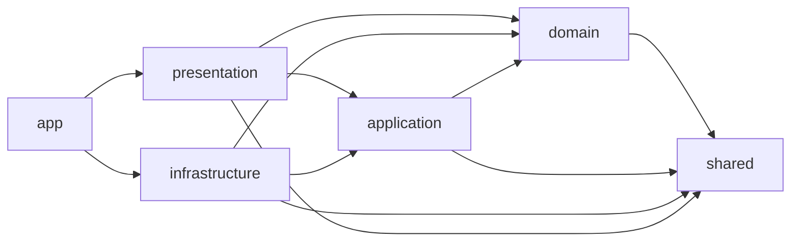

# Frontend architecture

The application follows Clean Architecture principles. Business rules remain independent from
React, HTTP clients, browser storage, and other external frameworks.

## Layers

```text
src/
├── app/             # Composition root, providers, and application bootstrap
├── domain/          # Enterprise entities, value objects, and repository contracts
├── application/     # Use cases and application ports
├── infrastructure/  # HTTP, persistence, and external service adapters
├── presentation/    # React pages, components, and presentation hooks
└── shared/          # Framework-independent primitives shared by inner layers
```

Directories are created when they receive their first concrete implementation. This avoids empty
folders and placeholder abstractions.

## Dependency rule



- `domain` never imports outer layers.
- `application` depends only on `domain` and `shared`.
- `infrastructure` implements ports owned by inner layers and never imports UI code.
- `presentation` invokes application use cases and never imports infrastructure directly.
- `app` is the only composition root allowed to connect concrete adapters to their ports.
- `shared` depends on none of the application layers.

Cross-directory imports use the `@/` alias. ESLint enforces the dependency rule and rejects imports
that point from an inner layer to an outer layer.

## Server boundary

The `server/` directory is a small backend-for-frontend and is kept outside the browser application.
It owns the TMDB credential and exposes only the API routes required by the UI. Client code must call
`/api/tmdb` and must never receive or import server environment variables.
